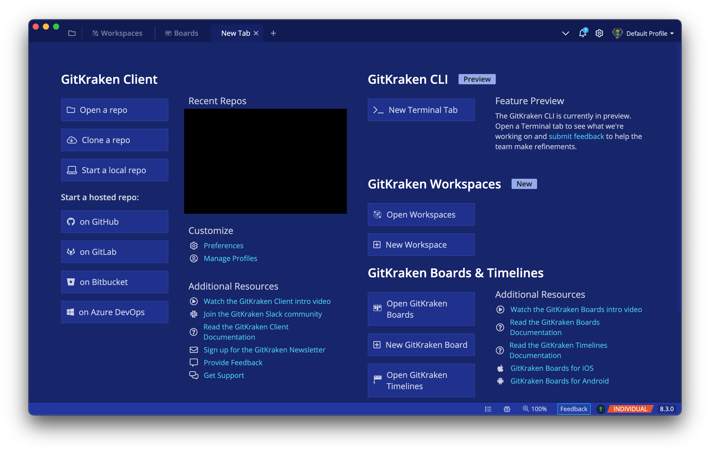
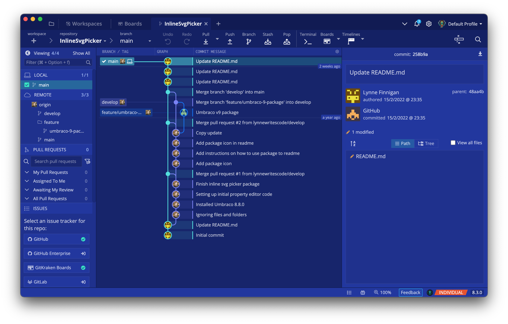

# eternal-blue-gitkraken-theme

A blue theme for GitKraken.

Place this .jsonc file inside the `/Users/Name/.gitkraken/themes` folder.

In `GitKraken`, find your new custom theme under `Preferences > UI Customization > Theme` and select `Eternal Blue`.

## Welcome Screen

## Open Repo

